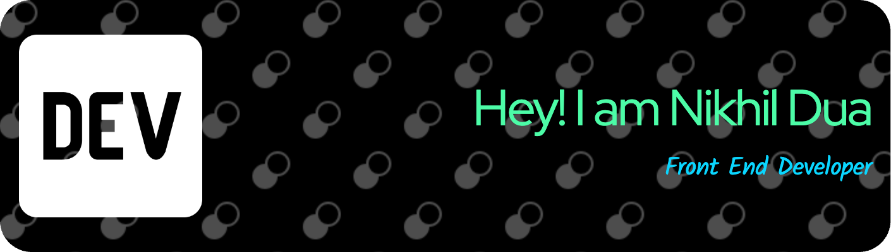

## 👨‍💻 About Me

Full-stack Developer with 10+ years of experience in building dynamic applications using React,
Node.js and modern javascript tools/frameworks. Committed to delivering high quality results
and working collaboratively to deliver high-quality software solutions.

📫 How to reach me
🔗 I have a personal website at xxx where all my social networks are located! You can reach me anywhere over there!

💼 Skills
📋 Languages
CSS3 HTML5 JavaScript TypeScript
### 📋 Languages

### 🕓 Version Control

| Name           | Badge                                                                                                                      | Markdown                                                                                                                     |
| -------------- | -------------------------------------------------------------------------------------------------------------------------- | ---------------------------------------------------------------------------------------------------------------------------- |
| Apache Subversion      |       | ``      |
| Bitbucket      |       | ``      |
| Forgejo        |       | ``      |
| Git            |                         | ``                        |
| Gitea          |                         | ``                        |
| Gitee          |                          | ``                         |
| GitHub         |                | ``               |
| GitLab         |                | ``               |
| Gitpod         |                   | ``                  |
| Mercurial      |          | ``         |
| Perforce Helix |  | `` |

### 💻 IDEs/Editors

  
  
  

<!--
**nikhilduacan/nikhilduacan** is a ✨ _special_ ✨ repository because its `README.md` (this file) appears on your GitHub profile.

Here are some ideas to get you started:

- 🔭 I’m currently working on ...
- 🌱 I’m currently learning ...
- 👯 I’m looking to collaborate on ...
- 🤔 I’m looking for help with ...
- 💬 Ask me about ...
- 📫 How to reach me: ...
- 😄 Pronouns: ...
- ⚡ Fun fact: ...
-->
